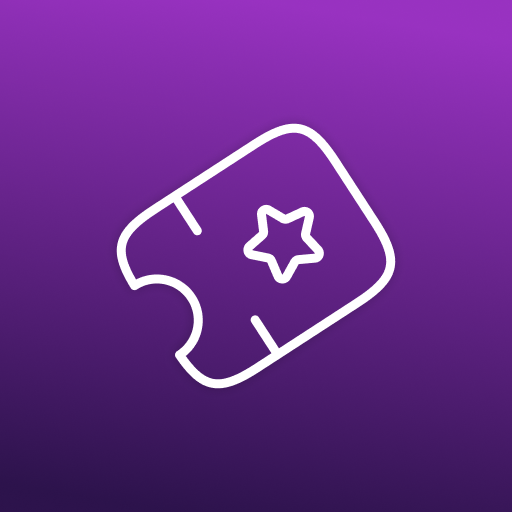

<div align="center">
  

  <h1>NeoCinema</h1>
  <em>Bring the magic of cinema to your Minecraft world</em>  

  <a href="https://modrinth.com/mod/neocinema"></a>  
  <a href="https://discord.gg/TURs8EMUSv"></a>
</div>

---
> 🚧 *Currently in active development - expect amazing updates!*

## 🍿 NeoCinema

NeoCinema is a Minecraft mod that allows players to view videos together in-game. It provides high-definition playback through VLC media player and supports YouTube, Twitch, and custom files hosted on the internet. The mod provides synchronized playback for all players, and provides customization of cinema screens and environments. It also has a queue system for continuous playback, which makes it an enjoyable and engaging social experience for players.

## 📥 Installation

### For users
1. Install [Fabric Loader](https://fabricmc.net/use/)
2. Download the latest version of NeoCinema from [Modrinth](https://modrinth.com/mod/neocinema) or [GitHub Releases](https://github.com/FrozenLabs/NeoCinema/releases)
3. Place the mod in your `mods` folder

### For server owners
1. Install the NeoCinema Bukkit plugin on your server, you can find it in the [GitHub Releases](https://github.com/FrozenLabs/NeoCinema/releases) 
2. Configure the plugin according to your needs
3. Ensure you have libav installed on your server. This is essential for plugin function.

And that's it! 🎉

## ⚙️ Dependencies

NeoCinema requires **LibVLC** for video playback:

- **Windows/macOS**: 🎉 Automatically downloaded!
- **Linux**: You'll need to install it manually:
  ```bash
  # Ubuntu/Debian
  sudo apt install libvlc-dev vlc
  
  # Arch Linux
  sudo pacman -S vlc
  
  # Fedora
  sudo dnf install vlc
  ```

## 📸 Screenshots

*Coming soon! The mod is still in development.*

## 🚧 Development Status

⚠️ **Note**: NeoCinema is currently in active development. Some features may be incomplete or unstable.

We welcome contributions! Check out our [issue tracker](https://github.com/FrozenLabs/NeoCinema/issues) for things to work on.

## 📜 License

NeoCinema is licensed under **AGPL-3.0-or-later**. See [LICENSE](LICENSE) for details.

---

<p align="center">
    <em>Crafted with ❤️ by <a href="https://lunasa.dev">Lunasa</a></em>
</p>

---